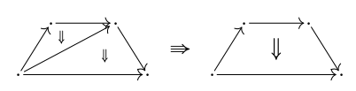
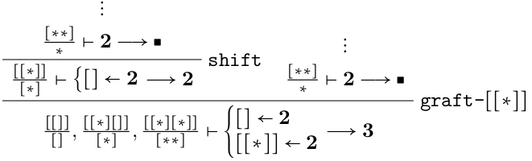
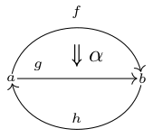
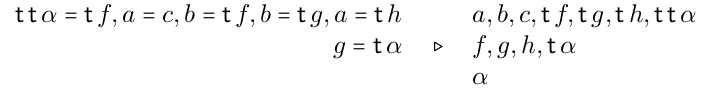

opetopy
=======

[](https://travis-ci.com/altaris/opetopy)
[](https://coveralls.io/github/altaris/opetopy?branch=master)
[](https://opetopy.readthedocs.io/en/latest/)

[](https://choosealicense.com/licenses/mit/)

This project is the Python implementation and proof of concept of the opetope
derivation systems presented in [**Syntactic approaches to
opetopes**](https://arxiv.org/abs/1903.05848), by [Pierre-Louis
Curien](https://www.irif.fr/~curien/), [Cédric Ho
Thanh](https://hothanh.fr/cedric), and [Samuel
Mimram](http://www.lix.polytechnique.fr/Labo/Samuel.Mimram). It also includes
some other work in progress.

# Examples

## An unnamed opetope

In system 'Opt?', deriving the 'classic' 3-opetope



can be done with the following code
```python
from opetopy.UnnamedOpetope import address, Graft, OpetopicInteger, OpetopicTree, Shift

proof = Graft(
    Shift(OpetopicInteger(2)),
    OpetopicInteger(2),
    address([['*']])
result = proof.eval()
)
```
which corresponds to the proof tree



Since the proof is valid, the code executes without throwing exceptions. To get
the final sequent, simply run
```python
print(result)
```
which outputs

```
ctx = {
    [[]] ↦ []
    [[*][]] ↦ [*]
    [[*][*]] ↦ [**]
}
src = {
    []: {
        []: ■
        [*]: ■
    }
    [[*]]: {
        []: ■
        [*]: ■
    }
}
tgt = {
    []: ■
    [*]: ■
    [**]: ■
}
```

## A named opetopic set

The following opetopic set,



can be derived in 'OptSet!' as follows:

```python
from opetopy.NamedOpetope import Point, Shift
from opetopy.NamedOpetopicSet import Glue, Repr, Sum

# Derive the main cells
alpha = Shift(Shift(Point("a"), "f"), "α")
g = Shift(Point("c"), "g")
h = Shift(Point("b"), "h")

# Sum them to obtain an 'unfolded' version
unglued = Sum(Sum(Repr(alpha), Repr(g)), Repr(h))

# Apply the `glue` rule repeatedly
example = Glue(
    Glue(
        Glue(
            Glue(
                Glue(
                    unglued, "a", "c"   # Glue a to c
                ), "b", "tf"            # Glue b to the target of f
            ), "b", "tg"                # etc.
        ), "a", "th"
    ), "g", "tα"
)
result = example.eval()

```

The final sequent is



which can be retrived by running

```python
print(result)
```

```
{tg, b, tf, ttα}, {th, a, c}, {tα, g} ▷ a : ∅, g : c ⊷ ∅, α : f ⊷ a ⊷ ∅, f : a ⊷ ∅, tf : ∅, ttα : ∅, th : ∅, c : ∅, tα : a ⊷ ∅, tg : ∅, h : b ⊷ ∅, b : ∅
```

## A coherence cell

We show how the ``tfill`` rule can be applied to derived weak composites of
1-cells:

```python
from opetopy.UnnamedOpetope import address, Arrow, OpetopicInteger
from opetopy.UnnamedOpetopicSet import (
    Graft, pastingDiagram, Point, RuleInstance, Shift)
from opetopy.UnnamedOpetopicCategory import TFill

# Derive points.
# This convenient syntax allows us to derive multiple points at once.
proof = Point(None, ["a", "b", "c"])

# Derive f.
# Recall that in the graft rule, we must derive the shape of the pasting
# diagram in system Opt? beforehand. We use the helper function Arrow() which
# returns the proof tree of an arrow.
proof = Graft(
    proof,
    pastingDiagram(
        Arrow(),
        {
            address('*'): "a"
        }
    )
)
proof = Shift(proof, "b", "f")

# Derive g.
proof = Graft(
    proof,
    pastingDiagram(
        Arrow(),
        {
            address('*'): "b"
        }
    )
)
proof = Shift(proof, "c", "g")

# Derive the composition and the compositor.
# As for f and g, we need to derive the shape of the compositor α before adding
# it. Here, we use the function OpetopicInteger which returns proof trees for
# opetopic integers.
proof = Graft(
    proof,
    pastingDiagram(
        OpetopicInteger(2),
        {
            address([], 1): "g",
            address(['*']): "f"
        }
    )
)
proof = TFill(proof, "h", "α")
result = proof.eval()
```

The resulting sequent is

```python
print(result)
```

```
ctx =
    a : ⧫
    b : ⧫
    c : ⧫
    f : {* ← a} → b
    g : {* ← b} → c
    h : {* ← a} → c
    α : {[] ← g, [*] ← f} → ∀h
pd =
```
We see that ``α`` is a target universal cell that witnesses the composition of
``f`` and ``g``.


# Documentation

Available at [readthedocs.io](https://readthedocs.io/en/latest/?badge=latest).
Generating the documentation requires
[Sphinx](http://www.sphinx-doc.org/en/stable/). After running
```sh
make docs
```
the HTML documentation should be located at `doc/build/html/index.html`.

# Tests

Unit tests are located in folder [tests](tests/), and can executed by running
```sh
make unittest
```

Additionaly, the code can be typechecked with [mypy](http://mypy-lang.org/)
(according to [PEP484](https://www.python.org/dev/peps/pep-0484/)) by running
```sh
make typecheck
```
